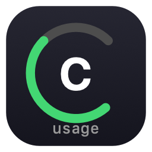

# Claude Usage Bar

<p align="center">
  
</p>

<p align="center">
  macOS menu bar app that displays your Claude Pro/Max subscription usage.
</p>

---

## Features

- **Status bar display** — Shows 5-hour and 7-day usage with color indicators
  - Green: < 70% | Orange: 70–90% | Red: > 90%
- **Click for details** — Usage breakdown with progress bars and reset countdown
- **Reset notification** — macOS push notification + `C: RESET!` flash when 5-hour limit resets
- **OAuth login** — Sign in with your Claude account. No API key needed, zero token cost
- **Auto-refresh** — Polls every 5 minutes, manual refresh on click
- **Right-click menu** — Quick access to Refresh and Quit

## Install

### Download (Recommended)

1. Download `ClaudeUsageBar-v*.zip` from [Releases](https://github.com/bouhyung/claude-usage-bar/releases)
2. Unzip and move `Claude Usage Bar.app` to `/Applications`
3. On first launch, macOS may block the app. Run this in Terminal:
   ```bash
   xattr -cr /Applications/Claude\ Usage\ Bar.app
   ```
4. Open the app

### Build from source

Requires macOS 14+ and Swift 6.

```bash
git clone https://github.com/bouhyung/claude-usage-bar.git
cd claude-usage-bar
./scripts/build.sh
open "dist/Claude Usage Bar.app"
```

## Usage

1. Click the status bar item (`C: --`)
2. Click **"Sign in with Claude"** — your browser will open
3. Log in to your Claude account
4. Copy the `code#state` value shown in the browser
5. Paste it into the app and click **Submit**
6. Done! Usage will auto-refresh every 5 minutes

### Status bar

```
5h:41% 7d:45%
```

- **5h** — 5-hour rolling window usage
- **7d** — 7-day rolling window usage
- Colors change based on usage level

### Controls

| Action | Result |
|---|---|
| Left-click | Open usage panel (+ manual refresh) |
| Right-click | Context menu (Refresh / Quit) |

## How it works

- Uses Anthropic's OAuth PKCE flow for authentication
- Calls `api.anthropic.com/api/oauth/usage` endpoint (no token cost)
- OAuth token stored locally at `~/.config/claude-usage-bar/token` (permissions `0600`)
- App runs as accessory (no Dock icon) with `LSUIElement`

## Requirements

- macOS 14 (Sonoma) or later
- Apple Silicon (arm64)
- Claude Pro or Max subscription

## License

MIT
